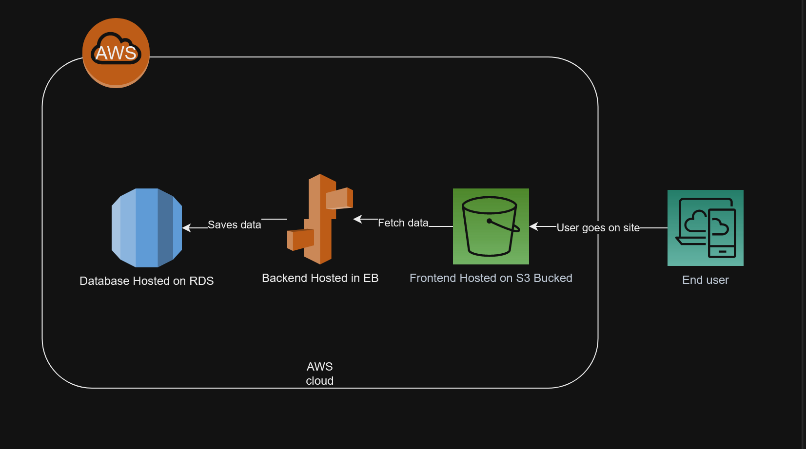

# Project Infrastructure with AWS Services

This document outlines the AWS infrastructure being used for this project. It serves as an easy reference for developers and system administrators working on the project.

## S3 Buckets

    Bucket Name: udacity-bucket-00001
    Purpose: Storage for static files such as images, JavaScript, and CSS.
    Region: us-east-1
    Access Policies: Public

## RDS Database

    DB Instance: awseb-e-yttucbsbqj-stack-awsebrdsdatabase-jv8b49vmwt3i
    Purpose: Main database for the application.
    DB Engine: PostgreSQL
    Version: 12.7
    Region: us-east-1
    Access Control: Public

## Elastic Beanstalk

    Application Name: Testumgebung-env
    Purpose: Hosting the main web application.
    Platform: Node.js
    Region: us-east-1

