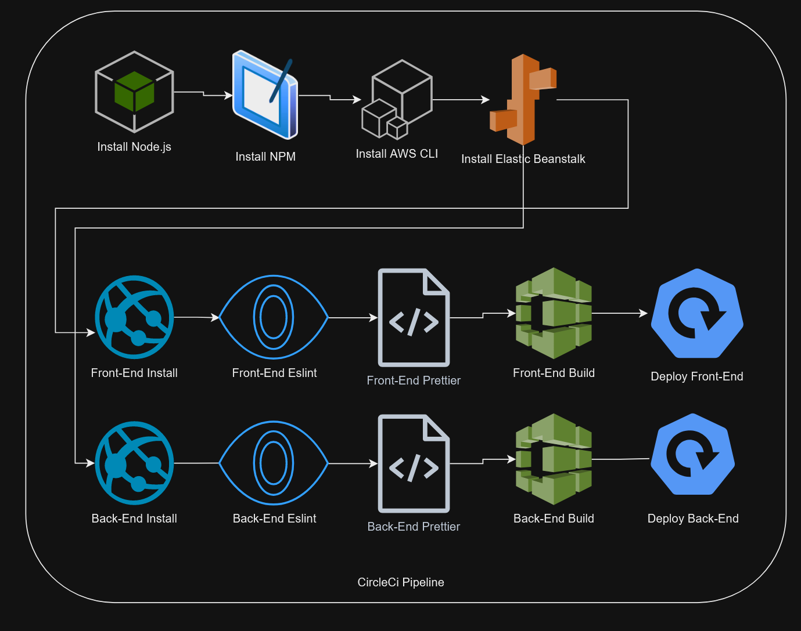

# Project Pipeline with CircleCi

This document outlines the CircleCi Pipeline being used for this project. 

## CircleCi Diagram

## CircleCi - Pipeline

- Spin up environment
This is the initial setup phase where you allocate the necessary resources, like CPU and memory, to run the subsequent steps in the pipeline. This is typically done using virtual machines, containers, or cloud-based runners.

- Preparing environment variables
Environment variables contain configuration settings that your application uses. This step sets up these variables so that they're available during the build and deployment process.

- Install NodeJs Node
Node.js is a JavaScript runtime that is often used for running JavaScript code on the server. This step installs Node.js to enable running your application and its build process.

- Checkout code
This step clones the code repository onto the runner so that subsequent steps can operate on the code.

- Install AWS CLI v2
AWS CLI (Command Line Interface) is a tool for interacting with AWS services. Version 2 is installed to manage cloud resources as needed.

- Disable AWS pager if not already configured
Some AWS CLI commands open results in a pager by default. Disabling this ensures that all command outputs are directly available for further actions in the pipeline.

- Configure AWS Access Key ID & Secret Access Key
These are your credentials for accessing AWS services. They are configured to authenticate your pipeline's interactions with AWS.

- Configure AWS default region
This specifies the geographical region where your AWS resources will be located.

- Install Elastic Beanstalk CLI
Elastic Beanstalk is a Platform as a Service (PaaS) from AWS. The CLI tool for Elastic Beanstalk is installed to 
manage deployments.

- Front-End Install
This installs all the dependencies required for the front-end part of your application, usually using a package manager like npm or yarn.

- Front-End Lint
Linting checks your front-end code for programming errors, bugs, stylistic errors, and suspicious constructs.

- Front-End Prettier
Prettier is a code formatter. It re-formats your front-end code to conform to style guidelines.

- Front-End Build
This compiles and bundles your front-end code, making it ready for deployment.

- Back-End Install
Similar to the front-end install, this installs all the back-end dependencies.

- Back-End Lint
This step lints your back-end code, checking for issues similar to the front-end lint step.

- Back-End Prettier
This formats your back-end code according to style guidelines.

- Back-End Build
This compiles and prepares your back-end code for deployment.

- Copy package
This step copies the package.json that is needed for deployment.

- Deploy Front-End & Back-End
These steps push the front-end and back-end packages to their respective servers or services, completing the deployment process.