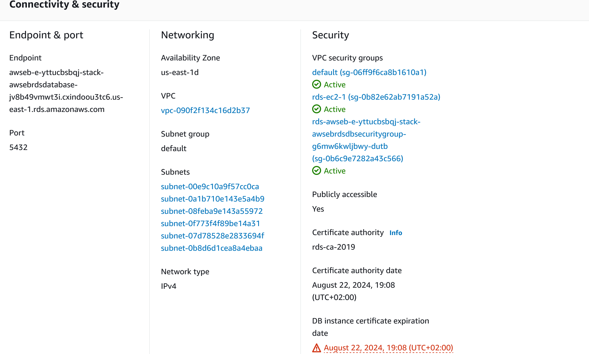

# Udacity - Hosting a Full-Stack Application
This application is made for Udacity - Hosting a Full-Stack Application with Node.js, Angular, Typescript, AWS RDS, AWS S3, AWS Elastic Beanstalk, CircleCi and github.

Frontend-Link: http://udacity-bucket-00001.s3-website-us-east-1.amazonaws.com/

Backend-Link: http://testumgebung-env.eba-6jy5svvu.us-east-1.elasticbeanstalk.com/

More detailed information at:
- Doc/Pipeline.md - CircleCi - Pipeline
- Doc/App_dependencies.md - Dependencies
- Infrastructure - App Infrastructure

### Dependencies

- Node 18.16.1 or more recent. While older versions can work it is advisable to keep node to latest LTS version

- npm 9.8.1 or more recent, Yarn can work but was not tested for this project

- AWS CLI v2

- A RDS database running Postgres.

- A S3 bucket for hosting frontend

- A Elastic Beanstalk Environment

### Installation

Provision the necessary AWS services needed for running the application:

1. In AWS, provision a publicly available RDS database running Postgres.
2. In AWS, provision a s3 bucket for hosting the uploaded files.
3. In AWS, provision a Elastic Beanstalk Environment for hosting the server.
4. From the root of the repo, navigate store-backend folder `cd store/store-backend` to install the node_modules `npm install`. After installation is done start the server with `npm run build` and `npm run start`.
5. Without closing the terminal in step 1, navigate to the store-frontend `cd store/store-frontend` to intall the node_modules `npm install`. After installation is done start the api in dev mode with `npm run start`.

## Testing

This project only backend test: Follow these steps to run the tests.

Test with: `cd store/store-backend && npm run test`

## Built With

- [Angular](https://angular.io/) - Single Page Application Framework
- [Node](https://nodejs.org) - Javascript Runtime
- [Express](https://expressjs.com/) - Javascript API Framework

## Screenshots

CircleCi - Screenshots

AWS services - Screenshots

RDS

S3

EB

